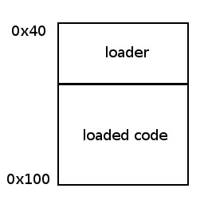

# Lab 5 — Reading Material

## Introduction

In this lab you will write your own program loader. In many cases, a program loader is used for dynamically linked executables, where some linking must be done at execution time (i.e. linking to library routines). Normal (static) executables are loaded into memory by the operating system. Your task will be to implement your own static loader, which loads a static executable into memory and transfers control to it. Your loader will be able to load all your code which uses the `system_call` interface.

## From the Specification

Program headers and static program loading are described in pages 2-1 up to 2-9 of the ELF file specification manual.

Some additional information is given below.

---

## Virtual Memory

Modern operating systems employ a scheme called Virtual Memory. This scheme enables each process to have its own view of memory, independent of other processes. The operating system (with help from the hardware) maps process memory (virtual pages) into real memory (real pages).

This way, each process can pretend it is the only process running on the system, and trust the operating system to ensure its memory does not collide with other processes.

## The Linker's Job

The introduction of virtual memory makes life much easier on the compiler and linker. The compiler generates code which thinks it is located at the beginning of memory (address `0x0`), and leaves information for the linker on where corrections need be made. The linker is in charge of choosing the memory layout of the program, and can decide to which address in virtual memory the code will be loaded.

A simple example will help illustrate the point. Look at the following code:

```c
char *message = "hello linker";

void foo() {
    printf("%s\n", message);
}
```

Compiling this code to produce an object file ends up looking like this:


When the linker is asked to link this code, and make it an executable, it needs to decide on the memory layout first: what will the virtual address of `foo()` be, and where in virtual memory will `message` be located?

After deciding on the memory layout, the linker needs to inform the loader how to load the executable. This is done by using program headers in the ELF format.

---

## The Static Loader

### Introduction

The job of the Loader is to load the executable into main memory. It does so by reading the program headers located in the ELF formatted executable, and acting accordingly.


Let us take a look at the program header of an ELF file:

```c
typedef struct {
    Elf32_Word p_type;   /* entry type */
    Elf32_Off  p_offset; /* file offset */
    Elf32_Addr p_vaddr;  /* virtual address */
    Elf32_Addr p_paddr;  /* physical address */
    Elf32_Word p_filesz; /* file size */
    Elf32_Word p_memsz;  /* memory size */
    Elf32_Word p_flags;  /* entry flags */
    Elf32_Word p_align;  /* memory/file alignment */
} Elf32_Phdr;
```

- `p_type`: The type of the entry. We are only interested in `PT_LOAD`, which means the loader must load the appropriate data from the file into memory.
- `p_offset`: The offset in the file, from which we start to load data.
- `p_vaddr`: The virtual address to which we load the data.
- `p_paddr`: The physical address. On x86 we can safely ignore this.
- `p_filesz`: Total amount of data which need to be mapped from the file.
- `p_memsz`: Total amount of data which needs to be mapped (can differ from `p_filesz`).
- `p_flags`: The flags:
    - `PF_R`: map for reading.
    - `PF_W`: map for writing.
    - `PF_X`: map for execution.
- `p_align`: The alignment needed. The linker must make sure this section's virtual address equals 0 modulo `p_align`.

One remark is in order: `p_filesz` can be different from `p_memsz`. This can happen when, for example, we need to allocate space for uninitialized variables in memory. There is no point in wasting space in the executable file for such variables (the section which holds these variables is traditionally called the `.bss` section).

---

## Implementation Issues

### Loader Virtual Memory

When implementing your loader, keep in mind the loaded program will "live" in the same address space as the loader. After loading the executable, the memory should look like this:



Now, "normal" code produced by the standard GNU tool chain (`gcc`, `ld`, etc.) is usually mapped to virtual memory starting at address `0x08048000`. This means that unless some special measure is taken, both the loader and the loaded program will be mapped to the same memory space, which will result in a nasty collision.

In order to solve this situation, we must satisfy at least one of the following conditions:

- Your loader will be mapped to a different (lower) address.
- The loaded program will be mapped to a different (higher) address.

In this lab we will satisfy condition (1) by asking the `ld` program to create our loader program so that it will get loaded into a lower address.

### Compilation of the Loader

To compile the loader, and tell the linker to map its code to the address we want, you will need to tell the linker to use a custom made linking script (you usually did not provide any script to the linker — you used the default one...). Furthermore, you need to use the `startup.o` object file, since it contains the `startup` function (for further details, look at task 2).

So, your command line will look something like this (note that the order is important, and that the flags from `-L/usr/lib32` onwards should appear after the `.o` files):

On a 64-bit machine (use `uname -a` to check if your OS is 64-bit or not):

```bash
gcc -m32 -c loader.c -o loader.o
ld -o loader loader.o startup.o start.o -L/usr/lib32 -lc -T linking_script -dynamic-linker /lib32/ld-linux.so.2
```

On a 32-bit machine:

```bash
gcc -c loader.c -o loader.o
ld -o loader loader.o startup.o start.o -lc -T linking_script -dynamic-linker /lib/ld-linux.so.2
```

### Mapping the Loaded Executable into Memory

When mapping the executable into memory, keep in mind the following. Use the following flags:

- `MAP_PRIVATE`: tell the mapping not to affect the file.
- `MAP_FIXED`: force the mapping to use the starting address you want.

Memory mapping which uses `MAP_FIXED` can only be performed to addresses congruent to `PAGE_SIZE` (`0x1000`). As a result, measures must be taken when mapping program headers which do not obey this restriction.

Solution for the previous point:

```c
vaddr   = phdr.p_vaddr  & 0xfffff000;
offset  = phdr.p_offset & 0xfffff000;
padding = phdr.p_vaddr  & 0xfff;
map = mmap(vaddr, phdr.p_memsz + padding,
           APPROPRIATE_PERMISSION_FLAGS, APPROPRIATE_MAPPING_FLAGS,
           fd, offset);
```
